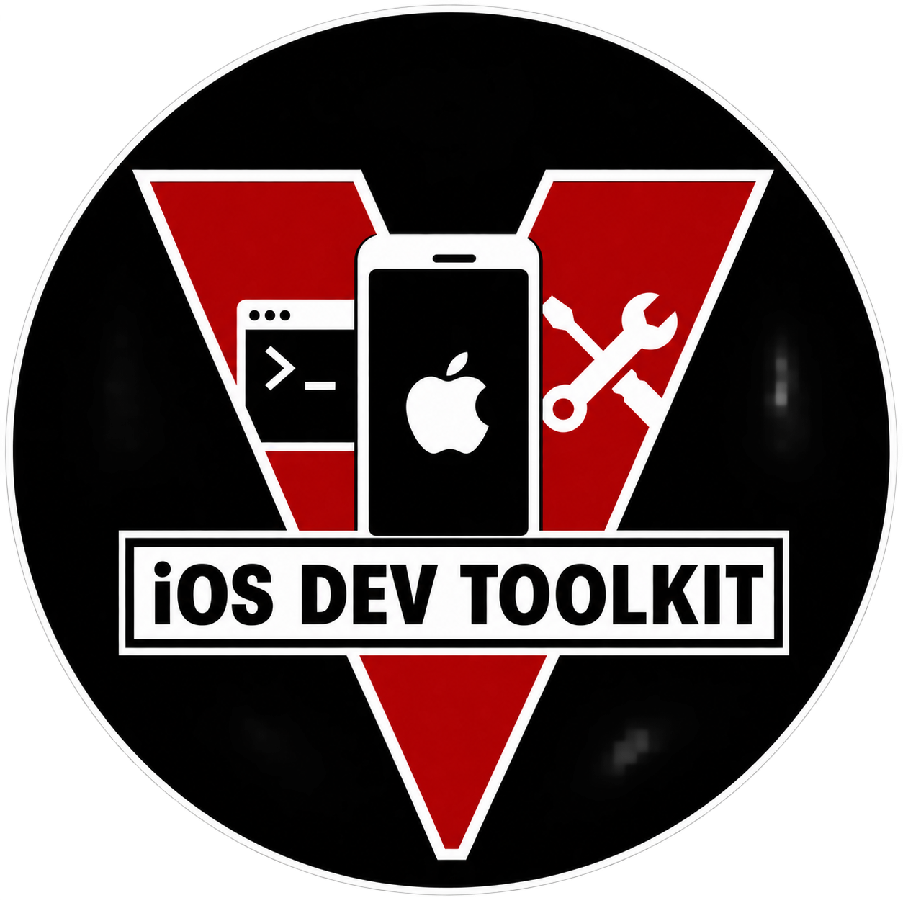
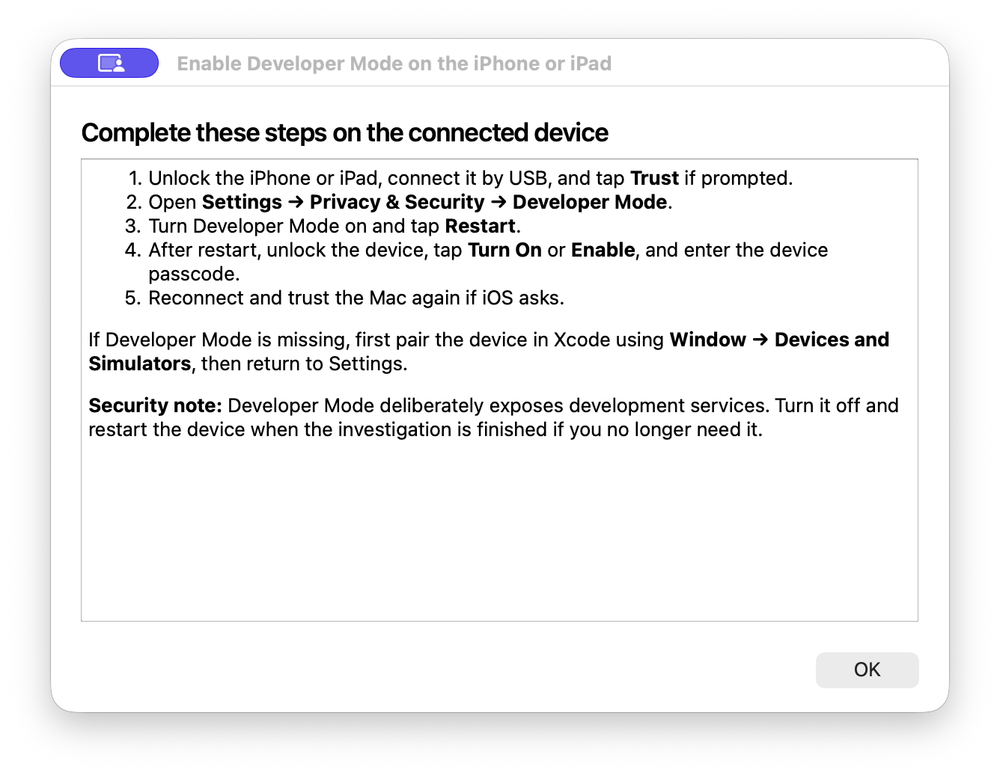
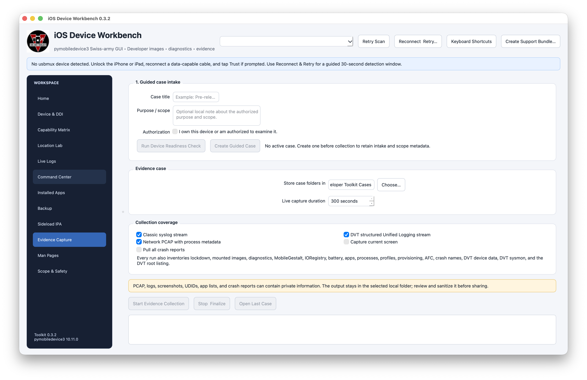
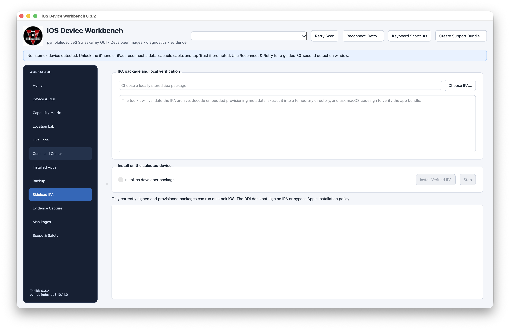
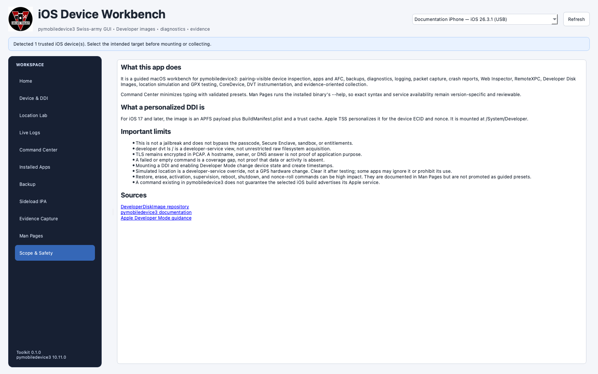

# iOS Developer Toolkit

<p align="center">
  
</p>

### iOS Device Workbench: a guided pymobiledevice3 GUI, Developer Disk Image mounter, and evidence toolkit for macOS


> **Scope:** iOS Developer Toolkit is a defensive macOS front end for authorized `pymobiledevice3` workflows, Developer Disk Image operations, app and backup management, and repeatable evidence collection. It does not jailbreak iOS, bypass a passcode, defeat code signing, decrypt protected traffic, or turn developer-service views into unrestricted filesystem access.


## Table of Contents

- [Overview](#overview)
- [Executive Summary](#executive-summary)
- [What it does](#what-it-does)
- [Architecture](#architecture)
- [Verified interface tour](#verified-interface-tour)
- [What a DDI is](#what-a-ddi-is)
- [Personalized DDI vs. local Xcode DDI](#personalized-ddi-vs-local-xcode-ddi)
- [Requirements](#requirements)
- [Install and launch](#install-and-launch)
- [Complete walkthrough](#complete-walkthrough)
- [Command Center](#command-center)
- [Man Pages and advanced commands](#man-pages-and-advanced-commands)
- [Evidence collected](#evidence-collected)
- [IPA sideloading and removal](#ipa-sideloading-and-removal)
- [Installed Apps inventory](#installed-apps-inventory)
- [Local device backups and encryption](#local-device-backups-and-encryption)
- [UFADE external forensic acquisition](#ufade-external-forensic-acquisition)
- [Command-line collector](#command-line-collector)
- [Interpretation and safety](#interpretation-and-safety)
- [Privacy and responsible use](#privacy-and-responsible-use)
- [Evidence and provenance](#evidence-and-provenance)
- [Troubleshooting](#troubleshooting)
- [Development and verification](#development-and-verification)
- [Repository structure](#repository-structure)
- [Sources and credits](#sources-and-credits)
- [License](#license)

## Overview

iOS Developer Toolkit turns the broad `pymobiledevice3` command surface into a device-aware desktop workbench. It recognizes trusted USB devices, explains the required Apple service layers, provides guided parameter forms, shows the exact argument vector before execution, and keeps long-running output visible. Focused workspaces cover Developer Disk Images, installed apps, IPA inspection and installation, MobileBackup2 backups, logs, packet capture, DVT/CoreDevice telemetry, and structured evidence cases.

The project is intentionally evidence-oriented. Successful execution proves that a particular Apple service returned data at a particular time; it does not prove that the observation is malicious or that the same visibility exists outside that service. Failed or empty output is retained as a coverage result rather than silently treated as absence.

## Executive Summary

- Standalone Python/PySide6 macOS application with its own icon and local `.app` wrapper.
- Automatic recognition and explicit selection of trusted iPhones and iPads over `usbmux`.
- Modern iOS 17+ personalized DDI mounting through downloaded or local Xcode/CoreDevice sources.
- Forty-nine low-typing guided command presets with typed validation, prerequisites, risk labels, exact previews, and visible stop controls.
- Fifty-eight live Man Page routes sourced from the pinned local `pymobiledevice3` executable.
- Installed-app inventory, optional size calculation, bundle-ID copying, and confirmed uninstall actions.
- Local IPA structure, provisioning, and macOS code-signature inspection before installation is enabled.
- Full or incremental MobileBackup2 backups with explicit persistent-encryption handling and no password in arguments or logs.
- External UFADE provider validation and launch for Logical, Logical+, UFD, and PRFS forensic acquisitions.
- Classic syslog, DVT Unified Logging, DVT Sysmon, screenshots, crash reports, and device-side PCAP capture.
- Timestamped cases with command logs, exit status, retry history, coverage gaps, a JSON manifest, and SHA-256 inventory.
- Direct argument execution without a shell; Advanced Mode parses arguments but does not evaluate pipes, redirects, substitutions, or shell operators.
- No one-click erase, firmware restore, supervision, activation, or other irreversible shortcut.

## What it does

The app organizes the Apple host-to-device protocol stack into nine sidebar workspaces:

- polls `pymobiledevice3 usbmux list` and recognizes paired iPhones and iPads;
- presents a Home dashboard that explains how usbmux, Lockdown, RemoteXPC, DDI, CoreDevice, and DVT fit together;
- offers 49 guided presets across device basics, apps/files, logging/capture, DVT/CoreDevice, discovery/Web Inspector, and device actions;
- validates preset parameters and previews the exact argument vector before direct execution;
- provides 58 live help topics covering every top-level command family from the supplied inventory plus important nested developer services;
- shows the selected device name, iOS/build version, model, and UDID;
- provides the exact on-device Developer Mode sequence;
- queries Developer Mode state;
- mounts a downloaded personalized Developer Disk Image;
- installs the local Apple/Xcode DDI as a personalized Cryptex;
- lists and removes the corresponding mounted image;
- runs a repeatable evidence collector with complete command output;
- streams classic syslog, DVT structured Unified Logging, and iOS PCAP;
- safely inspects IPA metadata, embedded provisioning, and the extracted app signature;
- installs a verified IPA and refreshes a searchable installed-app inventory;
- displays app name, bundle ID, version, type, and optional disk usage, with confirmed uninstall actions;
- creates full or incremental MobileBackup2 backups and can require persistent backup encryption;
- offers Advanced Mode for direct `pymobiledevice3` arguments without invoking a shell;
- gives high-impact restore, erase, activation, supervision, reboot/shutdown, and nonce operations stronger warnings;
- writes a manifest and SHA-256 inventory for every case.

### Direct capability vs. interpretation

| Type | What the toolkit establishes |
|---|---|
| Direct capability | A trusted USB device is visible to `usbmux` and can be selected explicitly. |
| Direct capability | A personalized developer image can expose Apple developer services at `/System/Developer`. |
| Direct capability | The collector can request documented lockdown, diagnostics, AFC, crash, DVT, logging, and PCAP services. |
| Direct capability | macOS `security` and `codesign` inspect a selected IPA locally before its install button is enabled. |
| Direct capability | Live Man Pages come from the pinned executable's current `--help`, not a copied and potentially stale web example. |
| Direct evidence | Each command, time, exit code, output path, package version, and coverage gap is recorded in `manifest.json`. |
| Interpretation boundary | A DVT root listing is a developer-service view, not an unrestricted raw-filesystem image. |
| Interpretation boundary | A process, profile, hostname, or endpoint is an observation—not proof of compromise or purpose. |

## Architecture

```mermaid
flowchart TB
    Device[iPhone or iPad]
    USB[Trusted USB pairing]
    Mode[Developer Mode]

    subgraph Host[macOS host]
        GUI[Sidebar Workbench]
        Presets[Guided Command Center]
        Help[Live Man Pages]
        PMD[pymobiledevice3]
        Repo[DeveloperDiskImage payload]
        Xcode[Local Xcode Candidate DDI]
        Case[Timestamped evidence case]
    end

    TSS[Apple TSS personalization]
    Dev[/System/Developer]

    Device <--> USB <--> GUI
    GUI --> PMD
    GUI --> Presets --> PMD
    GUI --> Help --> PMD
    GUI --> Repo
    GUI --> Xcode
    Repo --> TSS
    Xcode --> TSS
    TSS --> Dev
    Mode --> Dev
    PMD --> Case
```

The GUI never invokes user-entered commands through a shell. Guided values are validated into an argument tuple, and Advanced Mode uses `shlex` only to split the field before passing arguments directly to the project-local `pymobiledevice3` executable.

## Verified interface tour

The documentation images are project-specific GUI captures. They contain no private device capture, backup, UDID, account credential, or case export.

### Device recognition and DDI operations


The shared device selector applies across the workbench. The Device & DDI workspace explains Developer Mode, checks the local Xcode candidate path, exposes downloaded and local personalization choices separately, and pairs each mount path with the matching list/remove action.

### Developer Mode guidance



Developer Mode is an on-device security decision. The guide explains the Settings path, mandatory restart, post-restart confirmation, and the distinction between USB trust, Developer Mode, and a mounted developer image.

### Local Xcode/CoreDevice image


The local option verifies `/Library/Developer/CoreDevice/CandidateDDIs/iOS_DDI.dmg`, attaches the outer image read-only on macOS, validates the internal `Restore` payload, and delegates personalized Cryptex installation to the pinned toolchain.

### Repeatable evidence collection



Evidence Capture separates required snapshots from optional screenshots, crash pulls, logging streams, and PCAP. The live view preserves failures and progress while finalization records what completed, what failed, and what was not requested.

### IPA inspection and installation



The IPA workspace keeps host-side inspection distinct from device installation. A package must pass archive-path validation and local signature inspection before the user can confirm an install attempt.

### Scope and safety



The safety workspace keeps service-view, retention, encryption, authorization, and interpretation boundaries visible inside the application instead of leaving them only in documentation.

## What a DDI is

A Developer Disk Image supplies device-side services used by development and diagnostic tools. Mounting it expands the services available through the device's development interfaces; it does not replace iOS or grant unrestricted access.

There are two generations:

| Device generation | Image form | Toolkit behavior |
|---|---|---|
| iOS below 17 | `DeveloperDiskImage.dmg` plus `.signature` for a matching iOS version | Supported by upstream `pymobiledevice3`; this GUI is centered on the modern workflow. |
| iOS 17 and later | APFS image, `BuildManifest.plist`, and trust cache personalized for a device | Downloaded and mounted, or extracted from the local Xcode candidate and installed as a Cryptex. |

For a modern image, Apple TSS signs a personalization request using device-specific identifiers and a nonce. The resulting developer image is mounted at `/System/Developer`. The ticket does not turn the DDI into a jailbreak and does not bypass the passcode, Secure Enclave, sandbox, code-signing policy, or application entitlements.

## Personalized DDI vs. local Xcode DDI

The app deliberately exposes both supported modern paths.

| Choice | Source | Host network activity | Device result | Removal action |
|---|---|---|---|---|
| **Downloaded personalized DDI** | [`doronz88/DeveloperDiskImage`](https://github.com/doronz88/DeveloperDiskImage) through `pymobiledevice3 mounter auto-mount` | Downloads the APFS image, build manifest, and trust cache when the cache is missing or stale; normally contacts Apple TSS | Personalized image mounted at `/System/Developer` | `mounter umount-personalized` |
| **Local Apple/Xcode DDI** | `/Library/Developer/CoreDevice/CandidateDDIs/iOS_DDI.dmg` | No GitHub payload download; normally contacts Apple TSS | Local `Restore` payload installed as `com.apple.MobileAsset.DDI` through `cryptexd` | `cryptex uninstall com.apple.MobileAsset.DDI` |

### Downloaded personalized path

The upstream image repository publishes fixed payload names for the personalized mounter variant: `Image.dmg`, `BuildManifest.plist`, and `Image.dmg.trustcache`. `pymobiledevice3` caches these under:

```text
~/.pymobiledevice3/Xcode_iOS_DDI_Personalized/
```

It asks the device for personalization identifiers and a nonce, obtains or reuses an Apple personalization manifest, uploads the image and trust cache, and mounts the result.

### Local Apple/Xcode path


The Xcode candidate path is an **outer container**, not the image uploaded directly to iOS. The toolkit:

1. verifies that `/Library/Developer/CoreDevice/CandidateDDIs/iOS_DDI.dmg` exists;
2. attaches it on the Mac with `hdiutil` using `-readonly -nobrowse -noautoopen`;
3. verifies `Restore/BuildManifest.plist` inside the mounted container;
4. passes that `Restore` directory to `pymobiledevice3 cryptex auto-install --restore-dir`;
5. lets Apple TSS personalize the payload for the selected device;
6. detaches the temporary Mac-side image even when installation fails.

This path is useful when Xcode/CoreDevice has already installed a compatible candidate. The GUI reports whether the expected local file is present before a device operation begins.

## Requirements

- macOS 13 or later is recommended.
- Python 3.10 or later.
- A data-capable USB cable.
- An unlocked iPhone or iPad that trusts the Mac.
- Developer Mode enabled for DDI/DVT operations.
- Internet access for Apple TSS personalization.
- Internet access to GitHub only when the downloaded personalized path needs to refresh its cache.
- Xcode/CoreDevice candidate DDI only when using the local Apple/Xcode path.

No dependency is installed globally. The launcher creates a project-local visible `venv/` because hidden `.venv/` directories in File Provider-managed folders can mark Qt's Cocoa plugin hidden and prevent the GUI from launching.

## Install and launch

Clone the repository and run the project launcher:

```bash
git clone https://github.com/hideouts-io/iOS-Developer-Toolkit.git
cd iOS-Developer-Toolkit
./script/build_and_run.sh
```

The launcher:

1. creates `venv/` when needed;
2. installs the pinned package and dependencies into that environment;
3. stages `dist/iOS Developer Toolkit.app`;
4. opens the staged app.

The generated `venv/` and `dist/` directories stay outside version control. The wrapper is a local development build; build it from the source checkout with the command above.

Useful launch modes:

```bash
./script/build_and_run.sh --verify
./script/build_and_run.sh --debug
./script/build_and_run.sh --logs
./script/build_and_run.sh --telemetry
```

`--verify` waits for launch and proves the process remains alive. The logging modes stream host-side macOS logs; they are separate from the iPhone logging streams collected by the app.

## Complete walkthrough

Start on **Home**. The sidebar separates preparation, guided commands, focused workflows, evidence capture, reference material, and safety limits. The device selector in the header applies across every device-aware workspace.

### 1. Connect and trust the device

1. Connect the iPhone or iPad directly by USB.
2. Unlock it.
3. Tap **Trust** on the device if prompted and enter the device passcode.
4. Open the app and click **Refresh** if the device does not appear automatically.
5. If more than one trusted device is present, select the intended target from the menu before mounting or collecting.

The header remains explicit when no device is available, and device-changing buttons stay disabled.

### 2. Enable Developer Mode

Click **Show Steps** in the **Developer Mode** section.


On the iPhone or iPad:

1. Open **Settings → Privacy & Security → Developer Mode**.
2. Turn Developer Mode on.
3. Tap **Restart**.
4. After restart, unlock the device, tap **Turn On** or **Enable**, and enter the device passcode.
5. Reconnect and trust the Mac again if iOS asks.

If the setting is absent, first initiate pairing in Xcode under **Window → Devices and Simulators**, then return to Settings. Apple documents that Developer Mode appears after pairing is initiated or the device was previously paired.

Back in the toolkit, click **Check Status**. The app runs:

```bash
pymobiledevice3 mounter query-developer-mode-status
```

### 3. Choose and mount a DDI

Choose exactly one path:

- **Downloaded personalized DDI** for the simplest current iOS 17+ workflow.
- **Local Apple/Xcode DDI** when the candidate image exists and you prefer Xcode's local payload.

Review the confirmation dialog before proceeding. Both actions change device state and normally create network requests and timestamps.

After completion, click **List Mounted Images**. The app uses `mounter list` for the downloaded path and `cryptex list` for the local path. Treat a successful completion and an expected mounted entry as the verification pair.

### 4. Inspect and sideload an IPA

Open **Sideload IPA**, choose a local package, and wait for inspection to finish.

The toolkit validates archive paths, reads the main app's `Info.plist`, decodes `embedded.mobileprovision`, extracts the bundle into a temporary directory, and runs `codesign --verify --deep --strict`. Installation remains disabled when the signature is missing or invalid.

After a successful verification:

1. confirm the selected device;
2. select **Install as developer package** only when the IPA is a developer package;
3. click **Install Verified IPA** and review the exact target, package, bundle ID, version, and mode;
4. follow live output until the command finishes;
5. review the automatically refreshed **Installed Apps** tab.

The device still enforces signing, provisioning, Developer Mode, certificate trust, registered-device eligibility, and any App Store receipt or DRM requirements.

### 5. Review installed apps

Open **Installed Apps** and click **Refresh**. Use the filter to find an app by display name, bundle identifier, version, build, or application type. **Calculate sizes** asks iOS for static and dynamic disk usage and can make refresh slower.

Selecting one row enables **Copy Bundle ID** and **Uninstall Selected**. Uninstall always shows the selected device and exact bundle identifier before changing device state. The inventory stays in application memory; evidence collection separately saves its own `apps list` output.

### 6. Create a local backup

Open **Backup**, choose a parent destination, and click **Check Status** to read the selected device's persistent local-backup encryption setting.

- Leave **Require encrypted backup** selected to preserve existing encryption or enable it when currently off.
- If encryption is off, enter and confirm a new password. The toolkit sends it to a private helper through standard input, then clears the fields. It is not placed in process arguments, logs, manifests, or saved settings. Enabling encryption forces that run to be a full backup so unencrypted local state is not reused.
- If encryption is already on, the existing password and setting are preserved; no password is requested for the backup itself.
- Clear **Require encrypted backup** only to preserve the current device setting without enabling it. The toolkit never disables encryption automatically.
- Select **Force a full backup** to discard valid local incremental state; otherwise the backup is incremental when the destination contains complete metadata.

Apple says encrypted computer backups can include saved passwords, Wi-Fi settings, website history, Health data, and call history that unencrypted backups may omit. Store the password safely: an encrypted backup cannot be restored without it. See [Apple's encrypted-backup guidance](https://support.apple.com/en-ca/108353).

The backup is written under `<chosen destination>/<device UDID>/`. Stopping can leave an incomplete directory; the underlying backup engine will not treat incomplete metadata as valid incremental state on the next run.

### 7. Configure evidence collection

Open **Collect Evidence**.


1. Choose the parent directory for case folders.
2. Set a live-stream duration between 10 and 3,600 seconds.
3. Select any timed streams:
   - classic syslog;
   - DVT structured Unified Logging;
   - network PCAP with process metadata.
4. Optionally request the current device screenshot or a full crash-report pull.
5. Click **Start Evidence Collection** and review the privacy confirmation.

Snapshot commands run first. Each failing command is retried once and saved with a complete command log. Timed streams begin only after the required target inventory succeeds. **Stop & Finalize** requests a clean stop, writes the manifest, and hashes the artifacts already acquired.

### 8. Review the case

Click **Open Last Case**, then begin with:

```text
manifest.json
SHA256SUMS.txt
```

`manifest.json` records the target UDID, application and dependency versions, requested duration, start/end times, every command, attempt count, exit code, status, output path, and interpretation limits. A partial case is intentionally retained; a failed or empty command is a coverage gap, not evidence that the underlying data is absent.

### 9. Remove the developer image

Return to **Device & DDI** and use the removal button matching the path you installed:

- **Unmount Personalized DDI**, or
- **Uninstall Local DDI Cryptex**.

If Developer Mode is no longer needed, turn it off under **Settings → Privacy & Security → Developer Mode** and restart the device.

## Command Center

Command Center is the low-typing interface for the wider `pymobiledevice3` surface. Choose a category, search or select a preset, fill only the values that command actually needs, review its risk label and prerequisites, then press **Run Guided Command**.

The current catalog contains 49 presets:

| Category | Examples | What the GUI adds |
|---|---|---|
| Device Basics | usbmux inventory, Lockdown, activation state, diagnostics, battery, IORegistry, MobileGestalt, profiles | Explanations that separate exposed state from interpretation. |
| Apps & Files | app inventory/query, AFC listing, DVT listing, crash inventory/pull | Bundle/path validation and local destination pickers. |
| Logging & Capture | syslog, DVT OS log, PCAP, Bluetooth HCI | Privacy warnings, output-path validation, visible Stop control. |
| Developer & DVT | DVT device/process/app/network views, Sysmon, graphics, notifications, KDebug, screenshots, CoreDevice | DDI/tunnel prerequisites and service-view comparison notes. |
| Web & Discovery | Bonjour RSD, RemoteXPC browse, Web Inspector tabs | Clear distinction between discovery, pairing, authorization, and observation. |
| Device Actions | launch app, open Safari URL, set/clear simulated location | Explicit device-change badge and confirmation. |

Each preset previews a command such as:

```text
pymobiledevice3 developer dvt simulate-location set -- 34.0522 -118.2437
```

The preview is informational; execution uses a direct argument list, not a shell command string. Local paths, HTTP(S) URLs, bundle identifiers, coordinates, process identifiers, and device-service paths have kind-specific validation.

### Why there are not one-click buttons for every command

Some command families are intentionally reference-first:

- `restore` can update/restore firmware, boot an update ramdisk, and interact with Recovery/DFU.
- `profile erase-device`, `backup2 erase-device`, and supervision commands can make irreversible or high-impact changes.
- activation commands alter activation state; they are not Activation Lock bypasses.
- diagnostic restart/shutdown and mounter nonce-roll commands interrupt device state and can reboot.
- debugserver, WDA, interactive service shells, WebDAV, port forwarding, and persistent RSD tunnels need a longer-running external workflow rather than a fire-and-forget button.

They remain discoverable in **Man Pages** and runnable in **Advanced arguments**. High-impact prefixes receive a dedicated warning before the normal state-change confirmation.

## Man Pages and advanced commands

The **Man Pages & Possibilities** workspace starts the installed `pymobiledevice3` binary with the selected path plus `--help`. This matters because command names, options, tunnels, and Apple service availability move quickly.

The index includes:

- every top-level family in the attached command inventory: activation, AFC, AMFI, apps, backup2, Bluetooth logging, Bonjour, companions, crash, cryptex, developer, diagnostics, IDAM, Lockdown, mounter, notifications, PCAP, power assertions, processes, profiles, provisioning, remote, restore, SpringBoard, syslog, usbmux, Web Inspector, and version;
- nested DVT Sysmon, CoreProfile, location, condition, CoreDevice display/HID/location, debugserver, accessibility, and WDA topics;
- common leaf commands for apps, backups, crash pulling, battery, DDI mounting, PCAP, syslog, and Web Inspector.

**Use in Advanced Mode** copies the selected command prefix into Command Center. Add only the arguments shown by that live page. Advanced Mode still uses the selected device's UDID environment and never evaluates pipes, redirects, substitutions, or other shell operators.

### Advanced command interpretation

| Layer | Advanced examples | Correct interpretation |
|---|---|---|
| Lockdown services | AFC, Installation Proxy, MobileBackup2, diagnostics, syslog, profiles | Apple-defined service views available through the pairing relationship; not root. |
| RemoteXPC / RSD | `remote`, CoreDevice, modern display/HID/location | A transport and service-discovery layer. An advertised service can still reject or be absent on a specific build. |
| DVT / DTX | Sysmon, graphics, energy, OS log, notifications, CoreProfile | Instruments-like developer telemetry requiring Developer Mode and mounted developer support. |
| Packet/log capture | PCAP, syslog, OS log, Bluetooth HCI | Complementary observations; encryption and retention limits remain. |
| Process control | launch, signal, kill, debugserver | Changes runtime state and still operates within Apple service authorization. |
| Web automation | Web Inspector, CDP, WDA | Requires explicit device settings or a correctly signed WebDriverAgent; not arbitrary app automation by default. |
| Restore/profile management | IPSW, erase, supervision, activation, profile installation | High-impact administrative operations; use only with exact authorization and verified recovery plans. |

## Evidence collected

Every normal run requests these snapshots:

| Artifact | `pymobiledevice3` arguments | Purpose |
|---|---|---|
| USB inventory | `usbmux list` | Confirms the selected UDID remains connected. |
| Lockdown information | `lockdown info` | Device identity, version, build, and pairing-visible properties. |
| Mounted images | `mounter list` | Personalized image state. |
| Cryptex inventory | `cryptex list` | Installed Cryptex state. |
| Diagnostics | `diagnostics info` | Diagnostics-service information. |
| MobileGestalt | `diagnostics mg` | Values exposed through the known MobileGestalt query set. |
| IORegistry | `diagnostics ioregistry` | Device IORegistry data exposed by the diagnostics service. |
| Battery | `diagnostics battery single` | Point-in-time battery data. |
| Applications | `apps list` | Installed-application inventory visible to the service. |
| Processes | `processes ps` | Diagnostics process inventory. |
| Profiles | `profile list` | Installed configuration-profile inventory. |
| Provisioning | `provision list` | Installed provisioning-profile inventory. |
| Crash names | `crash ls` | Crash-report inventory. |
| AFC root | `afc ls /` | Media/AFC root listing, not the raw iOS root. |
| DVT device data | `developer dvt device-information` | Extended developer-service information. |
| DVT processes | `developer dvt sysmon process single` | Detailed point-in-time process data. |
| DVT filesystem | `developer dvt ls /` | DVT developer-service root view. |

Optional snapshots:

- `developer dvt screenshot artifacts/screen.png`
- `crash pull artifacts/crashes`

Optional timed streams:

- `syslog live`
- `developer dvt oslog`
- `pcap --out streams/network.pcap`

### Case layout

```text
ios-case-YYYYMMDDTHHMMSSZ-<UDID suffix>/
├── artifacts/
│   ├── crashes/                         # optional
│   └── screen.png                       # optional
├── snapshots/
│   ├── apps.json
│   ├── battery.json
│   ├── dvt-device-information.json
│   ├── dvt-root-listing.txt
│   ├── dvt-sysmon-processes.txt
│   ├── lockdown-info.json
│   ├── profiles.json
│   └── ...
├── streams/
│   ├── dvt-oslog.txt                    # optional
│   ├── network.pcap                     # optional
│   ├── pcap-metadata.txt                # optional
│   └── syslog.txt                       # optional
├── manifest.json
└── SHA256SUMS.txt
```

Each snapshot also has a neighboring `.command.log` containing all attempts and semantic-validation errors. `SHA256SUMS.txt` hashes every collected file except itself.

## IPA sideloading and removal


The sideload tab separates local package inspection from device mutation:

```text
Choose IPA
   |
   v
Validate ZIP members and main app Info.plist
   |
   v
Decode embedded.mobileprovision with macOS security
   |
   v
Safely extract to a temporary directory
   |
   v
Verify the app bundle with macOS codesign
   |
   +-- invalid or missing signature --> installation remains disabled
   |
   +-- valid signature --> user-confirmed pymobiledevice3 install
```

Inspection reports:

- app name, bundle identifier, version, build, executable, and minimum iOS;
- code-signature status, signing identifier, team identifier, authorities, and verification detail;
- provisioning profile status, name, UUID, application identifier, teams, expiration, device count, all-device flag, debug entitlement, and developer-certificate count.

Installation uses one of:

```bash
pymobiledevice3 apps install "/path/to/Application.ipa"
pymobiledevice3 apps install --developer "/path/to/Application.ipa"
```

The package path is passed directly to `pymobiledevice3`; it is not evaluated by a shell. The toolkit does not modify, decrypt, patch, or re-sign the IPA.

After a successful installation, the separate **Installed Apps** tab refreshes automatically. Select a row there and click **Uninstall Selected**. The app validates the bundle identifier and displays a destructive-action confirmation because uninstalling can remove the application's local data:

```bash
pymobiledevice3 apps uninstall com.example.application
```

A valid macOS code-signature verification proves that the extracted bundle is internally consistent at inspection time. It does not prove that the selected device is included in the profile, that Apple still trusts the certificate, or that iOS will accept the package.

## Installed Apps inventory

The inventory runs `pymobiledevice3 apps list --type Any` and validates that every result is keyed by the same bundle identifier reported in its metadata. Optional size calculation adds `--calculate-sizes`. Search and sorting happen locally after the device result is parsed.

The list can include Apple system apps, hidden service-visible entries, and user apps. Presence proves only that the installation proxy reported the bundle at collection time; it does not prove recent use or suspicious behavior.

## Local device backups and encryption

The Backup tab uses the same MobileBackup2 protocol as the pinned `pymobiledevice3 backup2` implementation. Encryption is a persistent setting for computer backups from that device, not a one-time wrapper around a single output folder. The toolkit therefore exposes three explicit behaviors:

| Device state and choice | Result |
|---|---|
| Encryption already enabled | The backup remains encrypted; the existing password is not requested or changed. |
| Encryption disabled + **Require encrypted backup** | The toolkit asks for a new password, enables persistent encryption, verifies the new state, then forces a full backup. |
| **Require encrypted backup** cleared | The current device setting is preserved; the toolkit does not enable or disable encryption. |

Passwords travel only in a JSON request on the helper's standard input and are cleared from the GUI fields after dispatch. The helper never emits the password. Backup files themselves are highly sensitive even when encrypted, so keep the destination out of Git and restrict who can access it.

## UFADE external forensic acquisition

The Backup workspace includes a separate **UFADE External** provider for [`prosch88/UFADE`](https://github.com/prosch88/UFADE), the GPL-3.0 Universal Forensic Apple Device Extractor. UFADE supplies its own CustomTkinter interface and acquisition workflows:

| UFADE choice | Upstream behavior |
|---|---|
| Logical | iTunes-style MobileBackup2 acquisition. |
| Logical+ | Backup plus AFC media, shared app folders, crash reports, and optional Unified Logs. |
| Logical+ UFD | Advanced logical ZIP with a UFD descriptor for compatible forensic tooling. |
| PRFS | Decrypted, filesystem-shaped logical archive assembled from service-visible data. |
| Full filesystem | SSH acquisition from an already jailbroken device; it is not a jailbreak or bypass. |

### Why UFADE remains external

The toolkit is MIT-licensed while UFADE is GPL-3.0. UFADE also requires Python 3.11 and currently pins a different `pymobiledevice3` release. To preserve both projects' license and dependency boundaries, this repository does not copy, vendor, import, patch, or redistribute UFADE code.

Instead, the provider:

1. asks for the root of a user-managed UFADE checkout;
2. verifies `ufade.py`, `requirements.txt`, and the expected GPL-3.0 license;
3. reads the checkout's declared UFADE version without importing it;
4. verifies a separate Python 3.11 executable and representative UFADE runtime imports;
5. asks for a protected working/output directory;
6. displays the selected Toolkit device as an informational cross-check;
7. launches `ufade.py` directly without a shell as an independent process.

UFADE performs its own device discovery, prompts, password handling, progress reporting, stopping, archive creation, and report generation. Closing iOS Developer Toolkit does not terminate a launched UFADE process.

### Install UFADE separately on macOS

The provider's **Copy Setup Commands** button copies:

```bash
brew install python@3.11 python-tk@3.11
git clone https://github.com/prosch88/UFADE.git
cd UFADE
python3.11 -m venv venv
venv/bin/python -m pip install -r requirements.txt
```

Select the resulting `UFADE/` checkout and `UFADE/venv/bin/python` in the provider page. If UFADE developer features are also required, follow its upstream instructions for cloning the optional developer-image submodule.

UFADE output can include decrypted backups, media, app-shared data, logs, reports, device identifiers, and account content. Store it outside the source checkout on an access-controlled volume. UFADE acquisitions, UFD/UFDR files, reports, captures, and backups are excluded by this repository's publication boundary.

## Command-line collector

The same evidence engine can run without the GUI:

```bash
venv/bin/ios-developer-collect \
  --udid DEVICE_UDID \
  --output-root "$HOME/Documents/iOS Developer Toolkit Cases" \
  --duration 300 \
  --include-syslog \
  --include-oslog \
  --include-pcap
```

Optional switches:

```text
--include-screenshot
--include-crash-pull
```

Exit status `0` means the requested collection completed, `2` means the case was finalized with optional coverage gaps, and `1` means a fatal or required-command failure occurred. In all cases where a case directory was created, review the retained manifest and outputs rather than relying only on the exit status.

## Interpretation and safety


- Use the toolkit only on devices you own or are authorized to examine.
- A DDI is not a jailbreak, exploit, passcode bypass, or Secure Enclave bypass.
- Developer Mode and DDI operations change device state. For evidence-sensitive work, preserve a backup or sysdiagnose first and record the time of each action.
- `developer dvt ls /` is not unrestricted raw-filesystem acquisition.
- AFC exposes its service-defined media view, not all protected app containers.
- PCAP does not decrypt TLS, QUIC, VPN, Private Relay, encrypted DNS, or application-layer encryption.
- Process metadata, ports, DNS names, TLS names, and IP ownership are attribution clues, not proof of application purpose or malicious behavior.
- Profiles, provisioning records, apps, processes, crashes, and retained strings show possible configuration or history; corroborate current activity separately.
- A locally valid IPA signature is not a device authorization or a bypass of Apple provisioning and trust policy.
- Empty output can mean unsupported service, permission limits, retention limits, version mismatch, or collection failure.
- Logs, PCAPs, screenshots, UDIDs, app inventories, profile data, and crash reports may contain sensitive information. Keep case folders out of Git and sanitize before sharing.

## Privacy and responsible use

Use the toolkit only with devices and data you own or are explicitly authorized to examine. Pairing records, backups, logs, screenshots, PCAPs, crash reports, profiles, provisioning data, application inventories, and device identifiers can expose personal or organizational information.

The repository ignores common private-output paths and file types by default, including `cases/`, `backups/`, `captures/`, reports, IPAs, profiles, certificates, DDI payloads, crash files, logs, PCAP, and PCAPNG. An ignore rule is a publication guard, not an access-control system: store sensitive output on an appropriately protected volume and inspect staged files before every commit.

The application never asks for a Mac administrator password. Device-backup encryption secrets are sent to a private helper over standard input, cleared from the GUI after dispatch, and excluded from process arguments and application logs. Do not paste device passcodes, Apple Account credentials, backup passwords, certificates, or pairing records into issues or public reports.

Before sharing a case, review at least:

- `manifest.json` for device identifiers, host paths, versions, and timestamps;
- snapshots for serial numbers, phone numbers, account identifiers, profiles, installed apps, and process metadata;
- logs and crash reports for user content, paths, URLs, tokens, and application state;
- PCAP/PCAPNG for IP addresses, DNS names, TLS names, and timing patterns;
- screenshots for messages, notifications, account names, and visible application data.

## Evidence and provenance

Each collection case records the selected UDID, toolkit and dependency versions, requested scope, start and end time, exact command argument list, attempt count, exit status, artifact path, and semantic validation result. `SHA256SUMS.txt` provides a post-collection integrity inventory; it is not a cryptographic attestation of device origin.

The collector preserves partial cases. A command failure, unsupported service, disconnect, or zero-length stream remains visible in the manifest and neighboring command log. This avoids converting a collection gap into a false claim that data was absent.

The evidence model has four boundaries:

| Boundary | Meaning |
|---|---|
| Acquisition | Data came from the named Apple service or host-side inspection command at the recorded time. |
| Coverage | The manifest states which requests succeeded, failed, were empty, or were not selected. |
| Integrity | SHA-256 detects later byte changes to retained case files but does not prove who created the original data. |
| Interpretation | Processes, endpoints, profiles, apps, crashes, and strings require corroboration before attribution or security conclusions. |

Repository screenshots are documentation artifacts, not evidence from a user case. The project does not ship captures, backups, DDI payloads, IPAs, pairing records, or generated reports.

## Troubleshooting

| Symptom | Check |
|---|---|
| No device appears | Use a data cable, unlock the device, tap **Trust**, and click **Refresh**. Verify with `venv/bin/pymobiledevice3 usbmux list`. |
| Developer Mode is missing | Initiate pairing in Xcode **Window → Devices and Simulators**, then check **Settings → Privacy & Security** again. |
| Developer Mode query fails | Keep the device unlocked, reconnect it, and confirm the selected UDID still appears in `usbmux list`. |
| DDI says Developer Mode is disabled | Complete the restart and post-restart **Enable/Turn On** confirmation on the device. |
| Downloaded image fails | Confirm GitHub and Apple TSS connectivity, review the exact output, and update only after checking compatibility with the pinned release. |
| Local Xcode option is unavailable | Verify `/Library/Developer/CoreDevice/CandidateDDIs/iOS_DDI.dmg`; install or update Xcode/CoreDevice if the file is absent. |
| Image is already mounted | Use **List Mounted Images**; do not repeatedly mount. Remove only the matching personalized/Cryptex path. |
| DVT commands fail after a mount | Re-check Developer Mode, mounted state, pairing, and whether the current iOS/pymobiledevice3 combination supports that service. |
| IPA inspection reports missing/invalid signature | Obtain a correctly signed package from its developer. The toolkit intentionally does not repair or re-sign it. |
| IPA verifies locally but installation fails | Review provisioning type, registered-device eligibility, certificate trust/expiration, Developer Mode, minimum iOS, and the complete `pymobiledevice3` output. |
| Installed Apps refresh fails | Keep the device unlocked and trusted, verify the selected UDID, and review the tab's raw error output. Size calculation can be disabled for a faster retry. |
| Backup encryption status fails | Keep the device unlocked and trusted. The toolkit will not guess the state or start a requested encrypted backup without a password when the state is unknown. |
| Backup stops or fails | Preserve the error output, confirm free disk space and USB stability, and retry. Incomplete local state is not reused as a valid incremental backup. |
| Guided command is disabled | Check the selected device, fill every required value, and satisfy any Developer Mode/DDI prerequisite shown in Command Center. |
| Command exists but its Apple service is unavailable | Compare the live Man Page with the complete output. Service advertisement and authorization vary by iOS build and transport. |
| Live Man Page fails | Confirm the project-local environment is intact with `venv/bin/pymobiledevice3 --help`; the help browser does not use a network copy. |
| PCAP is empty or ends early | Keep the device connected and active; review `pcap-metadata.txt`, `manifest.json`, and the stream's process exit status. |
| Qt reports that Cocoa cannot initialize | Remove the generated hidden `.venv/` if present and relaunch. The launcher uses visible `venv/` to prevent hidden Qt plugins. |
| Collection is partial | This is preserved intentionally. Review failed entries and `.command.log` files, then rerun only after correcting the specific service or connectivity error. |

## Development and verification

Install into the project environment through the launcher, then run:

```bash
venv/bin/python -m unittest discover \
  -s tests \
  -p 'test_*.py'

venv/bin/python -c 'import ios_developer_toolkit.app'
venv/bin/ios-developer-collect --help
venv/bin/ios-local-ddi --help
venv/bin/ios-ipa-inspect --help
./script/build_and_run.sh --verify
```

The generated macOS bundle is a local development wrapper around the project environment. It is not currently a self-contained signed/notarized distribution artifact.

## Repository structure

```text
iOS-Developer-Toolkit/
├── docs/screenshots/               # sanitized GUI documentation
├── ios_developer_toolkit/
│   ├── assets/                      # supplied project logo used by the GUI and package
│   ├── app.py                      # PySide6 GUI
│   ├── backup_worker.py            # password-safe MobileBackup2 helper
│   ├── catalog.py                  # collection and console command policy
│   ├── command_catalog.py          # guided presets, validation, risk, and live-help index
│   ├── collector.py                # case acquisition and finalization
│   ├── ipa_inspector.py            # safe IPA, provisioning, and signature inspection
│   ├── installed_apps.py           # validated app-inventory models and parsing
│   ├── local_ddi.py                # read-only Xcode DDI/Cryptex workflow
│   ├── models.py                   # validated device/result models
│   ├── runtime.py                  # project runtime and UDID environment
│   ├── ufade_connector.py          # external UFADE checkout/runtime validation
│   └── validation.py               # semantic process-output checks
├── macos/                          # local app-wrapper launcher and metadata
├── script/build_and_run.sh         # environment, bundle, launch, and verification entry point
├── tests/
├── LICENSE
└── pyproject.toml
```

## Sources and credits

- [Apple: Enabling Developer Mode on a device](https://developer.apple.com/documentation/xcode/enabling-developer-mode-on-a-device)
- [Apple: About encrypted backups](https://support.apple.com/en-ca/108353)
- [`pymobiledevice3` repository](https://github.com/doronz88/pymobiledevice3)
- [`pymobiledevice3` documentation](https://doronz88.github.io/pymobiledevice3/)
- [`DeveloperDiskImage` repository](https://github.com/doronz88/DeveloperDiskImage)
- [`developer-disk-image` on PyPI](https://pypi.org/project/developer-disk-image/)
- [`UFADE` repository](https://github.com/prosch88/UFADE) — external GPL-3.0 forensic acquisition provider

`pymobiledevice3`, `DeveloperDiskImage`, Apple, Xcode, iPhone, iPad, and iOS belong to their respective authors and owners. Review each dependency's license and terms independently. The toolkit's project metadata declares MIT for the toolkit code.

## License

The original iOS Developer Toolkit source in this repository is released under the [MIT License](LICENSE). Upstream projects, Apple software, downloaded Developer Disk Images, provisioning profiles, applications, and device data remain subject to their own licenses and terms. No Apple software or DDI payload is distributed by this repository.
