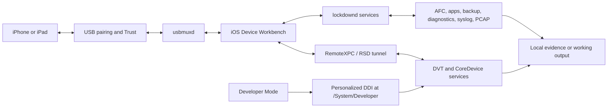
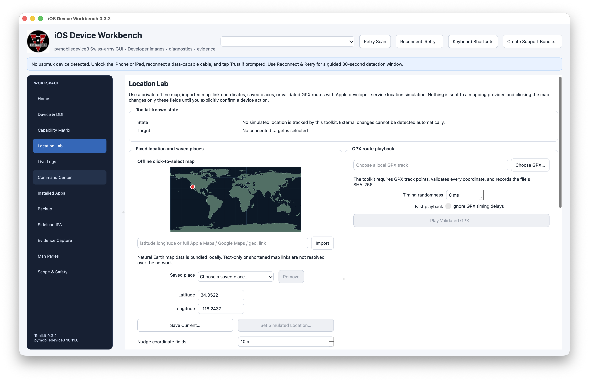
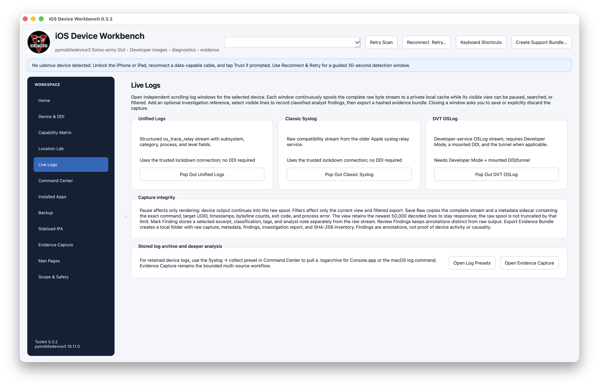
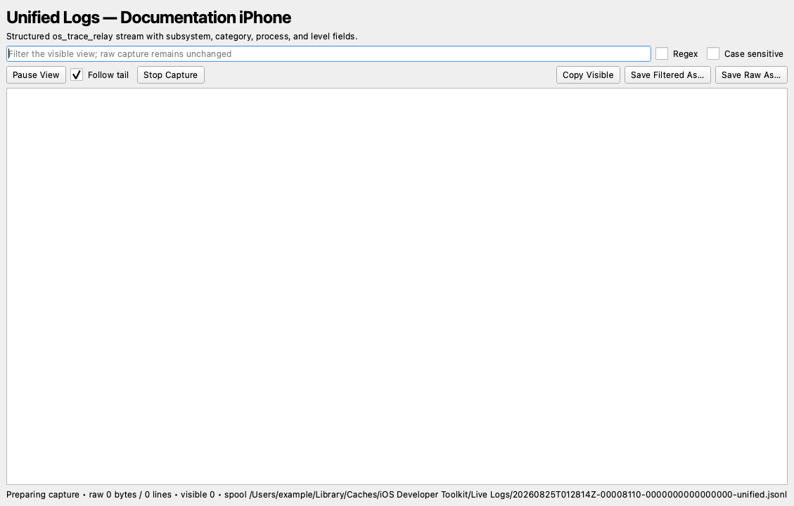
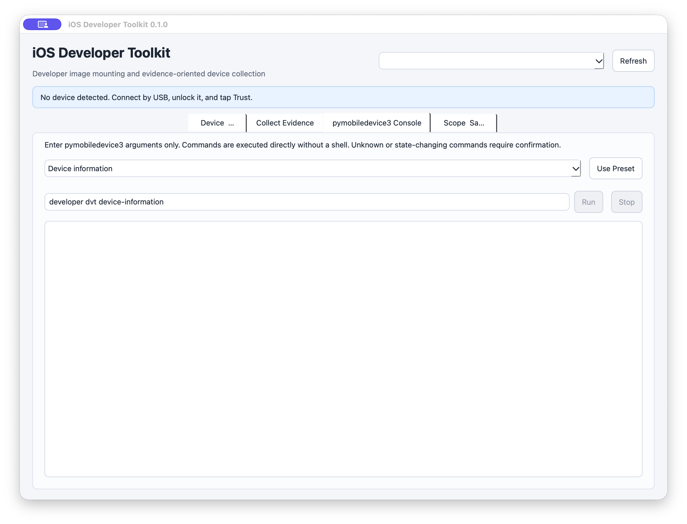
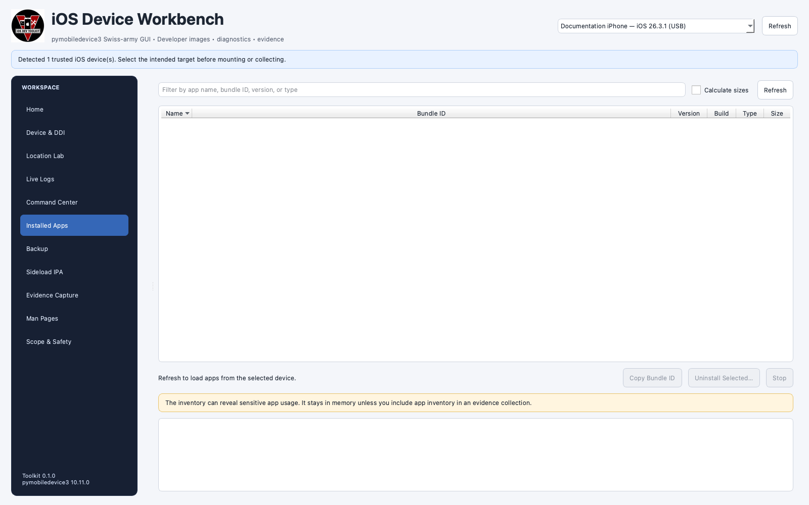
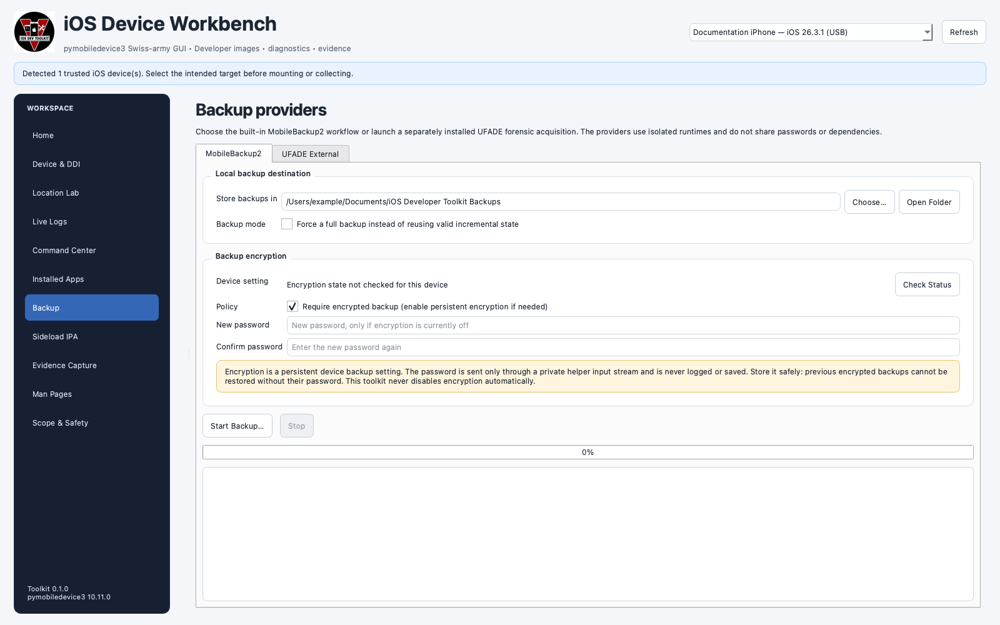
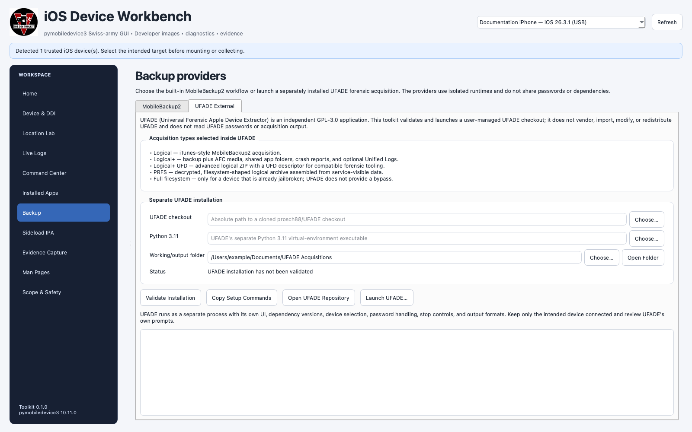
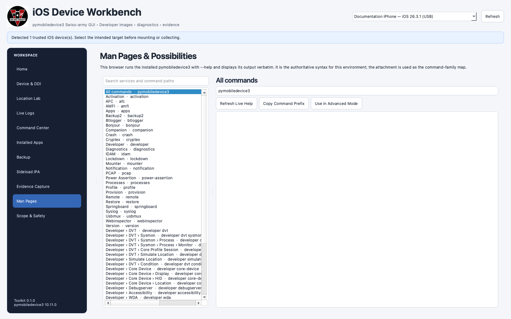

# iOS Developer Toolkit

<p align="center">
  
</p>

### iOS Device Workbench: a guided pymobiledevice3 GUI, Developer Disk Image mounter, and evidence workbench for macOS


> **Scope:** iOS Developer Toolkit is a macOS front end for authorized Apple-device development, diagnostics, testing, backup, and evidence-preservation workflows. It does not jailbreak iOS, bypass a passcode, disable the sandbox, defeat code signing, decrypt protected traffic, or provide unrestricted filesystem access.


The current interface organizes one trusted device connection into 12 focused workspaces. It mounts modern DDIs, checks device and developer-service readiness, runs validated `pymobiledevice3` presets, exposes the installed command help, simulates test locations, streams three forms of device logs, captures packets, inspects and installs eligible IPAs, inventories apps, creates encrypted backups, launches an isolated UFADE acquisition, and builds hashed evidence cases.

The screenshots use an illustrative device name, model, version, build, and UDID. They contain no real device capture, account identifier, backup, credential, or case evidence.

## Contents

- [Start here](#start-here)
- [What the workbench covers](#what-the-workbench-covers)
- [How the service layers fit together](#how-the-service-layers-fit-together)
- [Requirements](#requirements)
- [Installation](#installation)
- [First-device walkthrough](#first-device-walkthrough)
- [Workspace guide](#workspace-guide)
  - [Home](#home)
  - [Device and DDI](#device-and-ddi)
  - [Device Capability Matrix](#device-capability-matrix)
  - [Location Lab](#location-lab)
  - [Live Logs](#live-logs)
  - [Command Center](#command-center)
  - [Installed Apps](#installed-apps)
  - [Backup](#backup)
  - [Sideload IPA](#sideload-ipa)
  - [Evidence Capture](#evidence-capture)
  - [Man Pages](#man-pages)
  - [Scope and Safety](#scope-and-safety)
- [Developer Disk Images explained](#developer-disk-images-explained)
- [Guided command catalog](#guided-command-catalog)
- [Evidence case contents](#evidence-case-contents)
- [Command-line tools](#command-line-tools)
- [Privacy, integrity, and interpretation](#privacy-integrity-and-interpretation)
- [Troubleshooting](#troubleshooting)
- [Development and packaging](#development-and-packaging)
- [Project boundaries and credits](#project-boundaries-and-credits)
- [License](#license)

## Start here

Download the native `arm64` build for Apple Silicon or the native `x86_64` build for an Intel Mac from the [latest release](https://github.com/hideouts-io/iOS-Developer-Toolkit/releases/latest). Verify its checksum, extract the ZIP, and open **iOS Developer Toolkit.app**. The release bundle carries its pinned Python, PySide6, pymobiledevice3, and developer-image runtime; a repository checkout is not required. The GUI does not expose an interactive shell. IPython and Jedi remain source-installation tools, while the xonsh runtime is bundled because pymobiledevice3's AFC and backup services import it.

Connect an unlocked iPhone or iPad with a data-capable USB cable, tap **Trust** on the device, and select the intended target in the top-right device picker. Developer Mode and a mounted DDI are required only for workflows that use Apple developer services; basic pairing, Lockdown, apps, backups, AFC, classic syslog, and many diagnostics can work without them.

For a new device, a sensible sequence is:

1. Open **Device & DDI**, confirm the selected device, and check Developer Mode.
2. Mount the downloaded personalized DDI or install the local Xcode DDI Cryptex when a developer workflow requires it.
3. Run **Capability Matrix** to verify the exact host, trust, DDI, tunnel, and developer-service path.
4. Begin with read-oriented presets in **Command Center**.
5. Use **Live Logs**, **Installed Apps**, or **Evidence Capture** for the intended task.
6. Save sensitive output to protected local storage.
7. Stop streams, clear a simulated location, and unmount the developer image when finished.

The application executes the project-pinned binary directly. Guided values become an argument vector; the GUI does not pass them through a shell. Advanced Mode uses `shlex` to split arguments, but it does not evaluate pipes, redirects, substitutions, aliases, or shell operators.

## What the workbench covers

| Workspace | Primary purpose | DDI needed? | Important result |
|---|---|---:|---|
| **Home** | Understand the workflow and jump to a task | No | Service-layer overview and guided entry points |
| **Device & DDI** | Check Developer Mode; mount, list, or remove a developer image | For mounting | Explicit device target and image source |
| **Capability Matrix** | Test host, connection, trust, DDI, tunnel, and developer-service readiness | Only for the developer-service rows | Bounded per-capability state, evidence, and remediation |
| **Location Lab** | Set a coordinate or replay a validated GPX track | Usually | Structured location-event evidence and explicit Clear |
| **Live Logs** | Open independent Unified Logs, classic syslog, and DVT OSLog windows | Only DVT OSLog | Complete raw spool plus filtered working view |
| **Command Center** | Run 49 guided commands or explicit advanced arguments | Command-specific | Validated parameters, risk label, exact preview, exit output |
| **Installed Apps** | Search the service-visible app inventory and uninstall with confirmation | No | Names, bundle IDs, versions, types, optional sizes |
| **Backup** | Run MobileBackup2 or launch a separate UFADE environment | No | Full/incremental encrypted backup or external acquisition |
| **Sideload IPA** | Inspect a local IPA before attempting installation | No DDI for normal install | Archive, provisioning, and signature report |
| **Evidence Capture** | Correlate snapshots, timed streams, screenshots, crashes, and PCAP | Partial coverage without it | Timestamped case, coverage states, manifest, SHA-256 inventory |
| **Man Pages** | Browse 59 command routes instantly and request live help on demand | No | Version-matched syntax rather than copied examples |
| **Scope & Safety** | Keep access and interpretation limits visible | No | Operational boundaries inside the app |

Highlights of the current build:

- shared, explicit device selection across the full interface;
- a manual, read-only capability matrix with bounded subprocesses, cancellation, exact evidence, and no automatic probing;
- downloaded and local Xcode/CoreDevice DDI paths kept separate;
- fixed and GPX location simulation with bounded route generation and cleanup tracking;
- independent log windows that keep capturing while the visible view is paused;
- guided presets across device, app, logging, DVT, CoreDevice, discovery, Web Inspector, and device-action families;
- local IPA archive, provisioning, and macOS signature inspection before installation is enabled;
- searchable app inventory with optional size calculation and confirmed uninstall;
- MobileBackup2 encryption checks and new-password handling through a private helper input stream;
- isolated external UFADE validation and launch without importing its dependencies into this project;
- a multi-source collector that retains failures as coverage evidence and hashes finalized artifacts;
- no one-click erase, restore, activation, supervision, reboot, shutdown, or nonce-changing shortcut.

## How the service layers fit together



These layers are related but not interchangeable:

- **USB detection** means `usbmuxd` can see a paired device. It does not prove every service is available.
- **Trust** authorizes the host pairing relationship. It is separate from Developer Mode.
- **Developer Mode** enables development services after an on-device restart and confirmation.
- **A DDI** supplies the matching developer-service components. It does not grant root or bypass iOS protections.
- **RemoteXPC/RSD** is used by many modern developer services, especially on iOS 17 and later.
- **DVT/CoreDevice output** is a service-mediated view. A path such as `developer dvt ls /` is not a raw filesystem image.

## Requirements

- macOS 13 or later;
- Python 3.10 or later for this project;
- an unlocked iPhone or iPad you are authorized to test or examine;
- a data-capable USB cable;
- enough protected disk space for logs, PCAPs, backups, crash reports, and case output;
- internet access when the downloaded DDI cache must be populated or Apple TSS personalization is required;
- Xcode when using the local candidate DDI path or when iOS needs Xcode pairing before it exposes Developer Mode.

Current pinned runtime:

| Component | Version or path |
|---|---|
| Python | `>=3.10` |
| PySide6 | `6.11.2` |
| pymobiledevice3 | `10.11.0` |
| Local Xcode candidate | `/Library/Developer/CoreDevice/CandidateDDIs/iOS_DDI.dmg` |
| Toolkit release | `0.3.0` |

The current GUI and launcher are macOS-specific. Although upstream `pymobiledevice3` supports other host platforms, this application currently depends on macOS tools and conventions such as Xcode/CoreDevice, `hdiutil`, `security`, `codesign`, `.app` bundles, and macOS user-library paths.

## Installation

### Download the native application

Release `v0.3.0` provides two independent application bundles:

| Mac | Release asset |
|---|---|
| Apple Silicon (`arm64`) | `iOS-Developer-Toolkit-v0.3.0-macOS-arm64.zip` |
| Intel (`x86_64`) | `iOS-Developer-Toolkit-v0.3.0-macOS-x86_64.zip` |

Check the Mac architecture before downloading:

```bash
uname -m
```

Download the matching ZIP and `SHA256SUMS.txt` from the [release page](https://github.com/hideouts-io/iOS-Developer-Toolkit/releases/tag/v0.3.0), place them in the same directory, and verify the selected archive:

```bash
shasum -a 256 -c SHA256SUMS.txt
```

Extract the verified ZIP and move **iOS Developer Toolkit.app** to `/Applications` if desired. These builds are self-contained and ad-hoc code signed, but they are not Developer ID signed or Apple-notarized. macOS may therefore block the first launch. Use Finder’s **Open** command from the app’s contextual menu and review the publisher warning; do not disable Gatekeeper or recursively strip quarantine attributes.

### Clone the repository

For the current main branch:

```bash
git clone https://github.com/hideouts-io/iOS-Developer-Toolkit.git
cd iOS-Developer-Toolkit
./script/build_and_run.sh
```

For the published `v0.3.0` source state:

```bash
git clone --branch v0.3.0 --depth 1 https://github.com/hideouts-io/iOS-Developer-Toolkit.git
cd iOS-Developer-Toolkit
./script/build_and_run.sh
```

The launcher:

1. creates `venv/` when needed;
2. installs the pinned project dependencies into that environment;
3. stages `dist/iOS Developer Toolkit.app`;
4. opens the staged app.

The locally staged app is still a development wrapper around the repository environment. Use the architecture-specific release asset when you need a portable, self-contained application.

### Use a GitHub source archive

Download the source archive from the [releases page](https://github.com/hideouts-io/iOS-Developer-Toolkit/releases), extract it, open Terminal in the extracted folder, and run:

```bash
./script/build_and_run.sh
```

GitHub's automatically generated source ZIP and tarball are source packages. The two explicitly named macOS ZIP assets are the prebuilt applications.

### Verify the host first

```bash
sw_vers -productVersion
python3 --version
xcode-select -p
```

If `python3` is missing or older than 3.10, install a supported Python locally before launching. Dependencies belong in the project-created `venv/`; do not install this project's pinned packages globally.

If macOS warns about downloaded content, verify the release checksum and confirm that you obtained the archive from the intended repository. The native release is ad-hoc signed rather than Developer ID signed and notarized; do not use broad commands that recursively remove quarantine or weaken Gatekeeper.

### Launch and diagnostic modes

```bash
./script/build_and_run.sh
./script/build_and_run.sh --verify
./script/build_and_run.sh --debug
./script/build_and_run.sh --logs
./script/build_and_run.sh --telemetry
```

Re-running the launcher updates the environment from the current checkout and rebuilds the staged wrapper. The script also stops an existing toolkit Python process before launching the rebuilt copy, so finish or save active captures first.

## First-device walkthrough

### 1. Connect and trust

1. Connect the device by USB.
2. Unlock it.
3. Tap **Trust** if iOS prompts.
4. Enter the device passcode on the device, never into this toolkit.
5. Select the intended device in the global picker.

The blue banner reports discovery state. Keep only the intended device attached during a sensitive backup, install, location test, or acquisition.

### 2. Enable Developer Mode when needed


On iOS:

1. Open **Settings → Privacy & Security → Developer Mode**.
2. Turn Developer Mode on and restart when prompted.
3. After restart, unlock the device and confirm **Turn On** or **Enable**.
4. Reconnect and trust the Mac again if requested.

If the Developer Mode setting is missing, pair the device in Xcode through **Window → Devices and Simulators**, then check Settings again. Developer Mode expands the device's development attack surface; turn it off and restart after the work if it is no longer needed.

### 3. Mount the matching DDI

Open **Device & DDI**. For iOS 17 and later, choose either the downloaded personalized DDI or the local Xcode candidate. List mounted images after the operation and retain the output if the mount state matters to your case.

### 4. Verify capability readiness

Open **Capability Matrix** and run the manual check against the selected device. Review each row independently: a working Lockdown connection does not prove that Developer Mode, the DDI, an RSD tunnel, CoreDevice, DVT, or Web Inspector is ready. Resolve **Needs attention**, **Unavailable**, or **Blocked** results required by your intended workflow before continuing.

The matrix is a point-in-time readiness report, not a permanent certification. Save or copy the report when you need to document why a command was expected to work or which prerequisite remained unavailable.

### 5. Run the intended workflow

Use a guided workspace or a read-oriented Command Center preset first. The exact target, prerequisites, risk label, and argument preview are visible before execution.

### 6. Clean up

- Stop every live log, PCAP, metrics, or GPX playback process.
- Save or explicitly discard each pop-out log capture.
- Clear Location Lab state on the originally tracked device.
- Unmount the downloaded DDI or uninstall the local DDI Cryptex with the matching button.
- Protect or sanitize output before sharing it.

## Workspace guide

### Home


Home is the map of the application. It provides one-click entry points for preparing developer services, testing locations, running guided commands, collecting evidence, and reading advanced help. The protocol summary explains why logs, packets, processes, crash reports, and backups should be correlated rather than treated as interchangeable evidence.

### Device and DDI


This workspace shows the selected device name, iOS/build, model, and UDID; presents the on-device Developer Mode guide; queries Developer Mode state; and keeps the two modern DDI sources distinct.

#### Downloaded personalized DDI

The recommended iOS 17+ path runs `pymobiledevice3 mounter auto-mount`. Upstream retrieves the APFS image, `BuildManifest.plist`, and trust cache when needed, stores them under:

```text
~/.pymobiledevice3/Xcode_iOS_DDI_Personalized/
```

It then requests Apple TSS personalization for the selected device and mounts the result at `/System/Developer`. The matching cleanup action is **Unmount Personalized DDI**.

#### Local Apple/Xcode DDI


The local path uses:

```text
/Library/Developer/CoreDevice/CandidateDDIs/iOS_DDI.dmg
```

The toolkit attaches this outer host image read-only, validates its `Restore` payload and build manifest, asks `pymobiledevice3 cryptex auto-install --restore-dir` to personalize and install `com.apple.MobileAsset.DDI`, and detaches the host image even when an error occurs. The outer DMG itself is not uploaded directly to iOS. The matching cleanup action is **Uninstall Local DDI Cryptex**.

Both modern paths normally require Apple TSS access. A cached DDI payload does not guarantee that personalization can complete offline.

### Device Capability Matrix

The matrix is a manual readiness check for the currently selected device. It never runs merely because a device connects or because you open the workspace. **Run Capability Matrix** starts a separate bounded worker so a slow Apple service or Python import cannot freeze the interface; **Cancel** stops the current probe and preserves every completed result.

The current matrix reports:

- the project-pinned `pymobiledevice3` runtime;
- Apple `devicectl` and `xctrace` availability through `xcrun`;
- the selected device and transport from the most recent usbmux discovery;
- pairing and Lockdown trust;
- Developer Mode state;
- mounted Developer Disk Image records;
- the iOS 17+ Remote Service Discovery/tunnel route, inferred only after a successful CoreDevice request;
- CoreDevice device-information and lock-state services;
- DVT instrumentation reachability;
- Safari Web Inspector response state.

Every row uses one of six explicit states: **Ready**, **Needs attention**, **Unavailable**, **Blocked**, **Not tested**, or **Not applicable**. Select a row to see the bounded evidence and its next step. **Copy Report** creates a plain-text snapshot for a bug report or development note; command errors redact the selected device identifier.

The matrix does not mount a DDI, enable Developer Mode, start a tunnel daemon, change Safari settings, or unlock the device. A service being reachable at refresh time is not proof that every command in that family will succeed, and an empty Web Inspector tab list is different from a failed Web Inspector request.

### Location Lab



Location Lab uses Apple developer services for explicit application testing. It does not alter GPS hardware and does not claim to hide simulation from applications.

Capabilities:

- click a bundled, offline Natural Earth world map to select a coordinate without contacting a mapping service;
- import coordinates directly or extract visible coordinates from full Apple Maps, Google Maps, and `geo:` links;
- reject shortened or text-only map links instead of resolving them through an external service;
- validate finite latitude and longitude values and enforce geographic ranges;
- set a fixed simulated coordinate;
- nudge coordinate fields north, northeast, east, southeast, south, southwest, west, or northwest;
- select a nudge distance from 1 through 100,000 metres;
- save and remove named places in the local application-support folder;
- accept manual `latitude,longitude` waypoints;
- generate timestamped GPX routes using Walk, Run, Bicycle, Urban drive, Highway, or a custom speed;
- configure 1–60 second point intervals, 1–20 traversals, and forward or ping-pong travel;
- cap generated routes at 100,000 points;
- inspect a local GPX up to 64 MiB, reject DTD/entity input, require track points, validate every coordinate, and calculate SHA-256;
- report point count, timed-point count, first and last coordinates, distance, and expected duration;
- replay original timing, add bounded timing randomness, or explicitly choose fast playback;
- retain the original target identity for cleanup even if the global device picker changes;
- stop playback and issue Clear, including a retry-and-evidence path during application close;
- append structured events to `location-events.jsonl`.

Saved locations, map selections, imported coordinates, and generated routes stay local. The feature contains no address search, external geocoder, automatic route provider, location-link resolver, or anti-detection behavior. The bundled world map uses public-domain [Natural Earth 1:110m land data](https://www.naturalearthdata.com/downloads/110m-physical-vectors/).

Modern devices use `developer dvt simulate-location`; older supported paths use the legacy developer location service. Availability still depends on the selected iOS build, Developer Mode, DDI, and any required tunnel.

### Live Logs



Live Logs opens three independent windows, so investigators and developers can compare service views without forcing all data into a single combined stream.



| Window | Command family | DDI requirement | Format |
|---|---|---:|---|
| **Unified Logs** | `syslog live --format json --label` | No | Structured JSON lines from `os_trace_relay` |
| **Classic Syslog** | `syslog live-old` | No | Raw compatibility text stream |
| **DVT OSLog** | `developer dvt oslog --format json` | Yes | Structured developer-service stream |

Each window provides:

- a continuously scrolling view;
- Pause View without pausing the underlying capture;
- follow-tail control;
- literal or regular-expression filtering;
- case-sensitive filtering;
- copy-visible, save-filtered, and save-raw actions;
- an explicit Stop Capture action;
- save, discard, or cancel when closing an unsaved stream.

The complete raw byte stream is spooled below `~/Library/Caches/iOS Developer Toolkit/Live Logs`. A metadata sidecar records the exact command, target UDID, timestamps, byte and line counts, exit code, and process error. The responsive working view retains the latest 50,000 decoded lines and renders at most 20,000 blocks; those display limits do not truncate the raw spool.

For retained system log archives, use the applicable `syslog collect` command through Command Center/Advanced Mode and analyze the resulting `.logarchive` with Console.app or the macOS `log` tool.

### Command Center



Command Center is the low-typing interface to the pinned `pymobiledevice3` runtime. Search or filter a preset, review its description and prerequisites, fill only the required parameters, inspect the exact command, and run it directly.

Every preset has a visible risk class:

- **Read-oriented** requests information or starts an observation stream.
- **Writes output** creates a host-side artifact, such as a screenshot, crash pull, or PCAP.
- **Changes device state** launches an app, opens a URL, changes a simulated location, or performs another explicit device action.

Advanced Mode accepts a `pymobiledevice3` argument string. It never invokes a shell, but it can still reach high-impact upstream commands. Restore, erase, activation, supervision, reboot, shutdown, and nonce-related operations receive stronger confirmation and are intentionally not promoted as guided one-click actions.

Long-running commands remain attached to a visible Stop control. Stopping a process requests termination; always inspect the command output to determine whether the device or host operation completed before it stopped.

### Installed Apps



Refresh loads the app inventory for the selected trusted device. The table can search and sort by app name, bundle ID, version, build, type, and optional calculated size. It can copy a selected bundle ID and uninstall a selected app only after explicit confirmation.

The inventory is held in memory unless it is included in an evidence collection. App names and bundle IDs can reveal sensitive usage or organizational information; do not publish them without review.

An empty inventory is not proof that no apps exist. It may instead indicate device lock state, pairing, service availability, filters, command failure, or incomplete visibility.

### Backup



The Backup workspace keeps two providers isolated.

#### MobileBackup2

The built-in provider supports full and reusable incremental backup state. Before starting, it can query whether persistent backup encryption is enabled and enforce an encrypted-backup policy.

If encryption is currently off and **Require encrypted backup** is selected:

1. enter and confirm a new backup password;
2. the toolkit passes it to a private helper over standard input as structured data;
3. the password is cleared from the fields;
4. it is never placed in process arguments, normal logs, or saved settings;
5. the operation becomes a full backup because encryption state changed.

Backup encryption is a persistent device setting. The toolkit never disables it automatically. Store the password securely: an encrypted backup cannot be restored without it. Do not reuse an account password or device passcode.

Stopping a backup asks the worker to stop and preserves visible status. Confirm the finalized backup state before depending on it for recovery or evidence.

#### UFADE External

[UFADE](https://github.com/prosch88/UFADE) remains an independent GPL-3.0 application. This toolkit does not vendor, import, patch, relicense, or redistribute it.



The external provider validates:

- an absolute path to a user-managed UFADE checkout;
- the presence of `ufade.py`, `LICENSE`, and `requirements.txt`;
- the expected GPL-3.0 license text and UFADE version declaration;
- a separate Python 3.11 executable;
- UFADE's required runtime imports in that isolated environment;
- a user-selected working/output directory.

After validation, **Launch UFADE** starts its own process and UI. UFADE controls device selection, passwords, acquisition type, stop behavior, and output. The toolkit does not read its passwords or acquisition data and does not terminate it when the toolkit closes.

Acquisition choices are made inside UFADE:

- **Logical** — MobileBackup2-style acquisition;
- **Logical+** — backup plus additional service-visible media, shared folders, crash reports, and optional Unified Logs;
- **Logical+ UFD** — advanced logical ZIP with a UFD descriptor;
- **PRFS** — a decrypted, filesystem-shaped logical archive assembled from service-visible data;
- **Full filesystem** — only when the device is already jailbroken; the integration supplies no jailbreak or bypass.

##### Set up and launch UFADE on macOS

UFADE must use its own Python 3.11 environment. Do not install UFADE's pinned dependencies into the iOS Developer Toolkit environment. The **Copy Setup Commands** button provides the current recommended commands:

```bash
brew install python@3.11 python-tk@3.11
git clone --recurse-submodules https://github.com/prosch88/UFADE.git
cd UFADE
python3.11 -m venv .venv
.venv/bin/python -m pip install --upgrade pip
.venv/bin/python -m pip install -r requirements.txt
```

Then, in **Backup → UFADE External**:

1. Choose the cloned `UFADE` folder containing `ufade.py`, `requirements.txt`, and `LICENSE`.
2. Click **Use Checkout .venv**, or select `UFADE/.venv/bin/python` manually.
3. Choose a protected working/output directory with enough free space for the intended acquisition.
4. Click **Validate Installation** and resolve every missing-file, Python-version, submodule, or import error.
5. Connect, unlock, and trust only the intended device, then click **Launch UFADE**.
6. Select the acquisition and answer password prompts inside UFADE. Use UFADE's own progress and stop controls.

The selected toolkit device is shown only as a cross-check; UFADE performs its own discovery and device selection. Closing iOS Developer Toolkit does not stop the separately launched UFADE process. UFADE output may contain decrypted backups, app-shared data, logs, device identifiers, and account content, so keep it outside the source checkout on access-controlled storage.

Use UFADE's own documentation to assess version compatibility, licensing, dependencies, and the forensic meaning of each output format.

### Sideload IPA


Selecting an IPA starts host-side inspection before the install control can be enabled. The inspector:

- rejects absolute, parent-traversal, duplicate, ambiguous, and unsafe archive paths;
- locates the main `.app` and reads its `Info.plist`;
- extracts into a protected temporary directory;
- decodes `embedded.mobileprovision` with the macOS `security` tool when present;
- verifies the extracted app through macOS `codesign --verify --deep --strict`;
- reports bundle ID, display name, version, build, executable, signature status, team, certificate authorities, provisioning UUID, expiration, device count, debugging entitlement, and all-device provisioning state where available;
- keeps installation disabled when the signature is missing or invalid.

After inspection, choose normal installation or **Install as developer package** and confirm the operation. The toolkit does not sign, patch, re-sign, decrypt, or repair the IPA. Stock iOS still enforces package integrity, provisioning, trust, device eligibility, entitlements, and any App Store DRM. A DDI does not bypass those policies.

Successful installation refreshes the Installed Apps inventory. Removal is a separate confirmed action in that workspace.

### Evidence Capture


Evidence Capture creates a new timestamped case for the selected UDID. Every run includes the core snapshot set and can add timed streams or larger artifacts.

Core snapshots:

- connected-device inventory;
- Lockdown device information;
- mounted developer images and installed Cryptex inventory;
- diagnostics service information;
- known MobileGestalt values;
- IORegistry;
- one battery snapshot;
- installed apps;
- process inventory;
- configuration and provisioning profiles;
- crash-report inventory;
- AFC media-root listing;
- DVT device information;
- DVT detailed process snapshot;
- DVT root service-view listing.

Optional scope:

- classic syslog stream;
- DVT structured OSLog stream;
- device-side network PCAP;
- current device screenshot;
- complete crash-report pull.

The collector retries failed snapshots once, keeps the final artifact and a complete per-attempt command log, records semantic validation failures, and distinguishes required identification failures from optional coverage gaps. Stop/Finalize ends streams and still finalizes the case where possible.

### Man Pages



The Man Pages browser indexes 59 top-level and nested command routes. Selecting a route is immediate and does not start a process or contact the device. Click **Refresh Live Help** when you want the project-local executable's verbatim `--help` output. You can cancel a slow request, and the toolkit stops it automatically after 15 seconds so the page cannot remain stuck on “Loading live help.” Successful results are cached for the current app session. You can also copy the command prefix or send it to Command Center's Advanced Mode.

This is the safest source for exact syntax in the installed environment. A command listed by the client is still not proof that the selected device build advertises the corresponding Apple service.

The index covers activation, AFC, apps, backup, Bluetooth logging, Bonjour, companion, crash, Cryptex, developer services, diagnostics, IDAM, Lockdown, mounter, notifications, PCAP, power assertions, processes, profiles, provisioning, RemoteXPC, restore, SpringBoard, syslog, usbmux, Web Inspector, version, DVT, CoreDevice, DebugServer, accessibility, WDA, and other installed families.

#### Advanced command interpretation

The command catalog tells you what the installed client can request. Interpret its output according to the Apple service layer that produced it:

| Layer | Examples | Correct interpretation |
|---|---|---|
| Lockdown services | AFC, Installation Proxy, MobileBackup2, diagnostics, syslog, profiles | Apple-defined views available through the pairing relationship; not root or unrestricted storage access. |
| RemoteXPC / RSD | `remote`, CoreDevice, modern display, HID, and location services | A transport and service-discovery layer; an advertised service can still reject a request or be absent on a particular build. |
| DVT / DTX | Sysmon, graphics, energy, OSLog, notifications, CoreProfile | Instruments-like developer telemetry that generally depends on Developer Mode, a compatible DDI, and the required tunnel. |
| Packet and log capture | PCAP, syslog, OSLog, Bluetooth HCI | Complementary observations with independent encryption, retention, permission, and visibility limits. |
| Process control | Launch, signal, kill, DebugServer | Runtime-changing operations that remain constrained by Apple service authorization. |
| Web automation | Web Inspector, CDP, WDA | Features requiring explicit device settings or a correctly signed WebDriverAgent; not arbitrary application automation by default. |
| Restore and profile management | IPSW, erase, supervision, activation, profile installation | High-impact administrative operations requiring exact authorization, current syntax, backups, and a verified recovery plan. |

### Scope and Safety


The final workspace states the application's boundaries where they are visible during use:

- the app is a guided macOS workbench, not a jailbreak;
- a personalized DDI is a device-specific developer-service payload;
- a DVT listing is not unrestricted filesystem acquisition;
- TLS, process, app, DNS, profile, and endpoint observations require context;
- a failed command is a coverage gap, not proof of absence;
- Developer Mode, mounted images, logging, and location simulation can change device state or create sensitive artifacts;
- destructive upstream command families are documented through live help but not promoted as guided presets.

## Developer Disk Images explained

A Developer Disk Image supplies Apple device-side components used by developer and diagnostic services. The image must match the supported device generation and, on modern iOS, be personalized for the specific device.

| Generation | Typical image | Toolkit path |
|---|---|---|
| iOS below 17 | `DeveloperDiskImage.dmg` plus matching `.signature` | Supported upstream; not the main GUI workflow |
| iOS 17 and later | APFS image, build manifest, and trust cache | Downloaded personalized mount or local Xcode Cryptex install |

Modern personalization uses identifiers and a nonce obtained from the selected device. Apple TSS returns a device-specific personalization manifest, and the result is mounted as a developer image at `/System/Developer`.

What mounting a DDI can enable:

- DVT device and process instrumentation;
- developer OSLog streaming;
- CoreDevice queries;
- screenshots through developer services;
- simulated location services;
- developer-service filesystem listings;
- other services explicitly exposed by the device build.

What mounting a DDI does not do:

- grant root;
- bypass a passcode or Secure Enclave;
- disable app sandboxing or entitlements;
- decrypt protected data or traffic;
- make an invalid IPA installable;
- turn a developer-service view into physical or full-filesystem acquisition;
- guarantee every client-side command exists on every iOS build.

## Guided command catalog

The current Command Center contains 49 presets in six categories.

| Category | Count | Presets |
|---|---:|---|
| **Device Basics** | 13 | Connected devices; Lockdown overview; activation state; Developer Mode status; diagnostics overview; battery; IORegistry; MobileGestalt; processes; configuration profiles; provisioning profiles; screen orientation; Home Screen icon metrics |
| **Apps & Files** | 6 | Installed apps; one-app query; AFC directory; DVT path; crash inventory; crash pull |
| **Logging & Capture** | 4 | Live syslog; DVT Unified Logging; network PCAP; Bluetooth HCI capture |
| **Developer & DVT** | 19 | DVT device, process, app, network, PID, energy, system/process metrics, graphics, notifications, KDebug, screenshot; CoreDevice information, display, lock, processes, apps; mounted images; personalization identifiers |
| **Web & Discovery** | 3 | RSD discovery; RemoteXPC browsing; Safari and WebView tabs |
| **Device Actions** | 4 | Launch app; open URL; set location; clear location |

Presets minimize typing, not judgment. The displayed prerequisites and risks are part of the operation, and the exact argument preview should be retained when reproducibility matters.

## Evidence case contents

A finalized case follows this shape:

```text
ios-case-YYYYMMDDTHHMMSSZ-<udid-suffix>/
├── artifacts/
│   ├── crashes/                 # optional
│   ├── network.pcap             # optional
│   └── screen.png               # optional
├── snapshots/
│   ├── afc-root.txt
│   ├── apps.json
│   ├── battery.json
│   ├── crash-list.txt
│   ├── cryptex-list.json
│   ├── diagnostics-info.json
│   ├── dvt-device-information.json
│   ├── dvt-root-listing.txt
│   ├── dvt-sysmon-processes.txt
│   ├── ioregistry.json
│   ├── lockdown-info.json
│   ├── mobilegestalt.json
│   ├── mounter-list.json
│   ├── processes.txt
│   ├── profiles.json
│   ├── provisioning.txt
│   ├── usbmux.json
│   └── *.command.log
├── streams/
│   ├── dvt-oslog.txt            # optional
│   ├── pcap-metadata.txt        # optional
│   └── syslog.txt               # optional
├── manifest.json
└── SHA256SUMS
```

`manifest.json` records the toolkit and `pymobiledevice3` versions, target UDID, selected options, timestamps, commands, output paths, attempts, exit codes, and status for each step. `SHA256SUMS` inventories finalized files.

Hashes help detect later change; they do not by themselves prove when, where, or by whom evidence was acquired. Preserve the original case on protected storage, document custody separately, and analyze a verified copy.

Collector exit status:

| Exit | Meaning |
|---:|---|
| `0` | Required steps completed and no optional coverage failed |
| `2` | Case finalized with one or more optional gaps |
| `1` | Fatal setup or required target-identification failure |

## Command-line tools

The virtual environment exposes four entry points:

```bash
venv/bin/ios-developer-toolkit
venv/bin/ios-developer-collect --help
venv/bin/ios-local-ddi --help
venv/bin/ios-ipa-inspect --help
```

### Evidence collector

```bash
venv/bin/ios-developer-collect \
  --udid 00008110-0000000000000000 \
  --output-root "$PWD/cases" \
  --duration 300 \
  --include-syslog \
  --include-oslog \
  --include-pcap \
  --include-screenshot \
  --include-crash-pull
```

Use only the optional flags needed for the task. PCAP, screenshots, app lists, crash reports, profiles, and logs can contain private information.

### Local Xcode DDI installer

```bash
venv/bin/ios-local-ddi \
  --candidate /Library/Developer/CoreDevice/CandidateDDIs/iOS_DDI.dmg \
  --udid 00008110-0000000000000000
```

### IPA inspector

```bash
venv/bin/ios-ipa-inspect /absolute/path/to/Application.ipa
```

The CLI inspector reports local package state; it does not install or repair the IPA.

## Privacy, integrity, and interpretation

### Sensitive material

Treat these outputs as potentially sensitive:

- UDIDs, serials, pairing metadata, device names, and OS/build information;
- app and provisioning-profile inventories;
- URLs, hostnames, IP addresses, packet payloads, and Bluetooth traffic;
- Unified Logs, classic syslog, DVT logs, process lists, and crash reports;
- screenshots, AFC listings, GPX routes, and simulated coordinates;
- MobileBackup2 and UFADE acquisitions;
- IPA provisioning records and signing identities.

The repository `.gitignore` excludes the toolkit's common backup, case, capture, crash, log, packet, GPX, UFADE, DDI, certificate, profile, and IPA artifact patterns. That is a publication guard, not an access-control system. Store evidence outside a public checkout when possible, restrict filesystem permissions, encrypt sensitive archives, and review every staged file before committing.

### Capability is not observed behavior

| Observation | Supported conclusion | Unsupported shortcut |
|---|---|---|
| A DDI mounted | Developer services may now be available | The device is jailbroken or compromised |
| A process or app appears | The queried service reported it at that time | It performed a specific malicious action |
| A hostname appears in PCAP or logs | Traffic or text referenced that hostname | Ownership, purpose, or compromise without correlation |
| A profile appears | The profile service reported installation metadata | Who authorized it or how it was used without provenance |
| A DVT root path is listed | The DVT service exposed a path view | Raw, complete filesystem access |
| A command returned no data | The request produced empty output | The data or activity does not exist |
| A command failed | That collection path lacked coverage | The device is clean or the feature is absent |

Correlate timestamps and independent sources. Logs, network packets, processes, apps, profiles, crash reports, and backups answer different questions.

### Device-changing operations

Mounting a DDI, enabling Developer Mode, installing or uninstalling an app, changing backup encryption, creating a backup, launching an app, opening a URL, and simulating location all change device or host state. Obtain authorization, preserve pre-change state when relevant, and record the action.

## Troubleshooting

### No device detected

- click **Retry Scan** for an immediate usbmux check, or **Reconnect & Retry…** for a guided 30-second detection window;
- use a known data-capable cable and direct USB port;
- unlock the device and keep its Home Screen visible before reconnecting;
- on a USB-C iPhone or iPad, review **Settings → Privacy & Security → Wired Accessories** and allow the connection while unlocked;
- accept **Allow accessory to connect** on macOS, then accept **Trust** on iOS; Finder can also expose the device-level **Trust** action;
- reconnect after the trust prompt completes;
- close competing tools that may be holding device services;
- run `venv/bin/pymobiledevice3 usbmux list` and retain its error output;
- verify the selected device when more than one is connected.

The toolkit does not use `sudo`, delete pairing records, or restart SIP-protected Apple discovery agents or the root-owned `usbmuxd` service. If the iPhone is absent from both the macOS USB device tree and `usbmux list`, resolve the physical data connection before changing DDIs, tunnels, or developer services.

### Developer Mode is missing

- pair the device in Xcode through **Window → Devices and Simulators**;
- wait for Xcode's device preparation to complete;
- check **Settings → Privacy & Security** again;
- restart and complete the post-restart confirmation on the device.

### Personalized DDI does not mount

- confirm Developer Mode is enabled, not merely visible;
- verify that the device is unlocked and trusted;
- check internet access to the payload source and Apple TSS;
- open **List Mounted Images** before retrying;
- inspect the full command output for service, tunnel, version, personalization, or cache errors;
- do not substitute a random legacy DDI for a modern personalized image.

### Local Xcode DDI is unavailable

```bash
ls -l /Library/Developer/CoreDevice/CandidateDDIs/iOS_DDI.dmg
xcode-select -p
```

Install or update Xcode if the candidate is absent. The toolkit requires the expected `Restore` contents and rejects an incomplete or wrong container.

### A DVT/CoreDevice command fails

- confirm Developer Mode and DDI state;
- establish the modern tunnel when required by the installed `pymobiledevice3` command;
- treat **DVT network activity** and **CoreDevice applications** as streams: let them run for the intended observation window, then use **Stop**;
- read the corresponding live Man Page;
- remember that client syntax can exist even when an iOS build does not advertise the service;
- keep the failure as a coverage result.

### IPA inspection or installation fails

- treat archive-path and signature failures as package problems, not installer problems;
- confirm that the provisioning profile is current and includes the target device where required;
- confirm certificate trust, entitlements, team identity, and app identifier;
- do not expect a DDI to repair signing or bypass DRM;
- inspect the complete host and device error rather than repeatedly retrying.

### Backup does not start

- unlock and trust the device;
- verify free space and permissions on the destination;
- check encryption state explicitly;
- confirm and securely retain a new encryption password before enabling it;
- use a new destination to distinguish corrupt incremental state from a device-service failure;
- remember that changing encryption forces a full backup.

### Live Logs becomes visually busy

- pause the view; raw capture continues;
- apply a literal or regex filter;
- save the filtered view only as an analysis derivative;
- use Save Raw for the complete capture and metadata;
- stop and close the window cleanly to make the save/discard decision explicit.

## Development and packaging

### Repository layout

```text
.
├── ios_developer_toolkit/
│   ├── app.py                  # PySide6 workbench and workflow orchestration
│   ├── backup_worker.py        # MobileBackup2 worker and password-input protocol
│   ├── capability_matrix.py    # typed readiness catalog, probes, and result validation
│   ├── capability_matrix_worker.py # bounded NDJSON capability worker
│   ├── catalog.py              # evidence snapshot catalog and mutation classification
│   ├── collector.py            # case creation, streams, retries, manifest, hashes
│   ├── command_catalog.py      # guided presets and live-help routes
│   ├── installed_apps.py       # app inventory validation and formatting
│   ├── ipa_inspector.py        # safe IPA extraction, provisioning, signature checks
│   ├── live_logs.py            # independent raw-spooling log windows
│   ├── local_ddi.py            # local Xcode candidate/Cryptex workflow
│   ├── location_lab.py         # coordinates, GPX, routes, saved places, evidence
│   ├── models.py               # typed device and collection models
│   ├── entrypoint.py           # packaged internal CLI and worker dispatch
│   ├── runtime.py              # source/frozen commands and device environment
│   ├── ufade_connector.py      # isolated external UFADE validation and launch
│   └── assets/
├── .github/workflows/          # native Intel and Apple Silicon release builds
├── docs/screenshots/           # sanitized current-interface captures
├── macos/                      # wrapper executable, Info.plist, and icon
├── packaging/                  # pinned PySide6 deployment configuration
├── scripts/                    # self-contained native release builder
├── script/build_and_run.sh     # environment, staging, launch, verification modes
├── tests/                      # core, capability, and packaged-runtime tests
├── pyproject.toml              # package metadata and pinned dependencies
└── LICENSE
```

### Run the verification suite

```bash
venv/bin/python -m unittest discover -s tests -v
venv/bin/python -m compileall -q ios_developer_toolkit
venv/bin/python -m ios_developer_toolkit.collector --help
venv/bin/python -m ios_developer_toolkit.local_ddi --help
venv/bin/python -m ios_developer_toolkit.ipa_inspector --help
./script/build_and_run.sh --verify
```

The final launcher check opens the application and briefly verifies the process. It stops an existing toolkit process first, so do not run it during an active capture or backup.

### Release model

The release workflow builds natively on separate Apple Silicon and Intel GitHub-hosted macOS runners. Each job creates a self-contained PySide6/Nuitka `.app`, runs all 51 tests, verifies the embedded pymobiledevice3 command, checks the internal worker route, runs the 79-button offscreen GUI smoke test, verifies the Mach-O architecture, applies an ad-hoc signature, and uploads an architecture-labeled ZIP. The release job publishes both archives with one SHA-256 inventory.

The artifacts are not universal binaries: choose the ZIP matching `uname -m`. They are also not Developer ID signed or Apple-notarized because this repository has no release signing identity. A future signing upgrade should use a narrowly scoped Developer ID Application certificate, hardened runtime, Apple notarization, and stapling without changing the two-architecture verification gates.

Windows and Linux would require a separate host implementation or deliberately isolated adapters for discovery, pairing, filesystem paths, DDI acquisition, local signature inspection, packaging, and platform-specific dependencies. Copying the macOS wrapper is not a cross-platform port.

## Project boundaries and credits

- [`pymobiledevice3`](https://github.com/doronz88/pymobiledevice3) supplies the Apple-device protocol implementation and command surface.
- [`DeveloperDiskImage`](https://github.com/doronz88/DeveloperDiskImage) supplies the downloadable modern DDI payload used by upstream auto-mount.
- [Apple Developer Mode documentation](https://developer.apple.com/documentation/xcode/enabling-developer-mode-on-a-device) describes the on-device security workflow.
- [`UFADE`](https://github.com/prosch88/UFADE) is supported only as a separately installed and independently licensed external provider.
- [`ostrace`](https://github.com/BerkayCaglar/ostrace) informed live-log interaction design; no GPL source is copied, imported, or linked into this MIT project.
- [`LocationSimulator`](https://github.com/Schlaubischlump/LocationSimulator) informed the offline map/teleport workflow. Its GPL source is not copied or linked, and its public backend does not support iOS 17 or later.
- [Natural Earth](https://www.naturalearthdata.com/) provides the public-domain 1:110m land geometry rendered into the bundled offline Location Lab map.
- The project logo is stored at `ios_developer_toolkit/assets/iosdevtoolkit.png` and is used unchanged in the application and documentation.

Location Lab uses the pinned `pymobiledevice3` developer-service commands and this project's own map interaction, link parsing, validation, route, cleanup, and evidence code. Modern devices use the DVT path instead of the incompatible public LocationSimulator backend.

Apple, iPhone, iPad, iOS, macOS, and Xcode are trademarks of Apple Inc. This project is independent and is not affiliated with or endorsed by Apple.

Use the toolkit only on devices and data you own or are explicitly authorized to test, administer, develop against, or examine.

## License

This repository is released under the [MIT License](LICENSE). External tools and upstream dependencies retain their own licenses.
