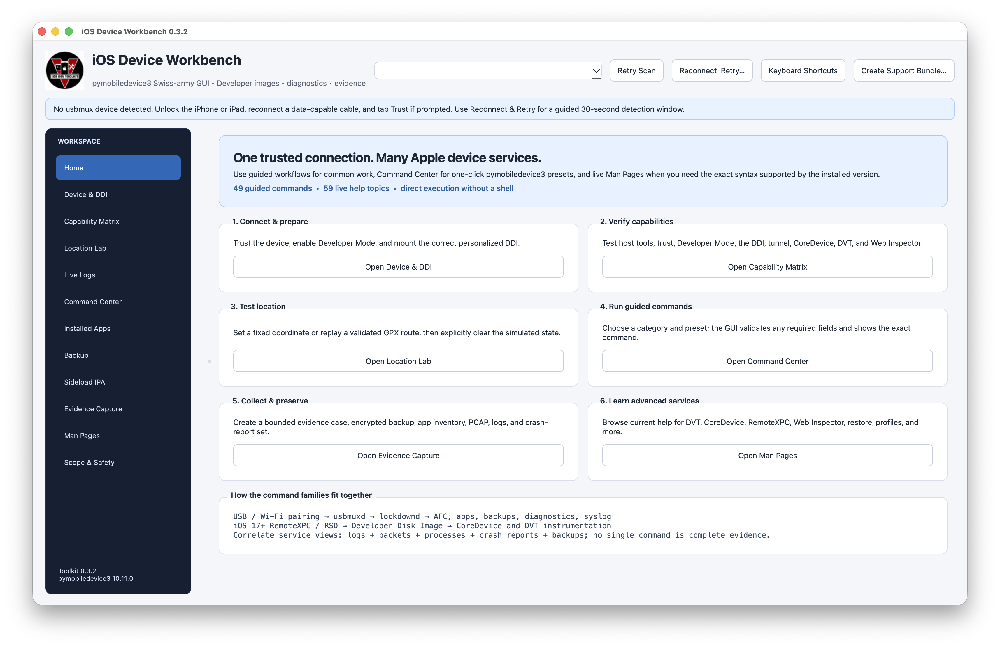

# iOS Developer Toolkit

## One guided macOS workbench for Apple-device services

iOS Developer Toolkit makes authorized iPhone and iPad development, diagnostics, backup, logging, package inspection, and evidence-preservation workflows visible without hiding their prerequisites or interpretation limits.

[Start with a device](quick-start.md){ .md-button .md-button--primary }
[Review the safety boundary](safety.md){ .md-button }

## Choose your path

### First-time operator

Connect one unlocked device, establish trust, and use the one-click Capability Matrix before choosing a workflow.

[Open the quick start](quick-start.md)

### iOS developer

Understand the Lockdown, RemoteXPC, DDI, CoreDevice, and DVT layers, then use guided presets or native Xcode handoffs.

[Read the architecture guide](architecture.md)

### Investigator

Preserve raw logs and bounded collection results, review coverage gaps, and separate tool output from analyst conclusions.

[Review safety and privacy](safety.md)

### Contributor or verifier

Use the public tests, dual-architecture packaging checks, SBOMs, checksums, and GitHub attestations.

[Verify a release](release-verification.md)

## Current product map

The application contains 13 workspaces spanning connection and DDI readiness, location testing, live logs, guided commands, app inventory, backup providers, IPA inspection, evidence capture, optional ecosystem tools, installed-command help, and visible scope boundaries. Local workspace profiles can move reviewed control defaults between team members without carrying targets, paths, credentials, coordinates, case text, parameters, or output.

The [canonical README](https://github.com/hideouts-io/iOS-Developer-Toolkit#readme) remains the complete feature reference and screenshot walkthrough. This site separates the most common audience paths so setup, architecture, safety, troubleshooting, release verification, and contribution material are easier to find without maintaining a second copy of every command.

!!! note "Independent community project"

    This project is not affiliated with or endorsed by Apple, the pymobiledevice3 maintainers, or the maintainers of optional external tools.
